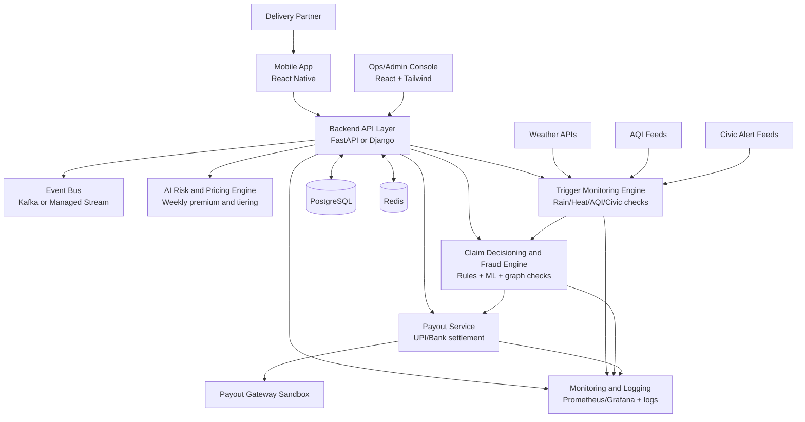

# Negansurance - Idea Document

Negansurance is an AI-enabled parametric income-protection product for
q-commerce delivery partners in India. It is designed for workers whose income
depends on daily shifts and is heavily affected by external disruptions like
rain, heat, pollution spikes, and local restrictions.

## 1) Problem and Opportunity

India's gig delivery partners face repeated income shocks from disruptions
outside their control, including:

- Heavy rainfall and flooding
- Extreme heat events
- Severe AQI days
- Local curfews or sudden zone closures

These disruptions reduce active working hours and can cut monthly income by
20-30%. Today, there is no low-friction, week-to-week income protection built
for this earning pattern.

Negansurance addresses this gap using a weekly parametric model with objective
external triggers and one-click manual claims.

## 2) Persona Focus

**Primary persona:** Q-commerce delivery partners (Blinkit/Zepto-style).

Why this persona first:

- Hyperlocal, shift-based work makes disruption impact measurable by zone/time.
- Short-distance deliveries are directly affected by weather and AQI.
- Weekly earnings align with weekly premium and payout cycles.

## 3) Coverage Scope

### Covered

- Income loss only from verified external parametric events.

### Not Covered

- Health insurance
- Life insurance
- Accident/hospitalization expenses
- Vehicle repair, maintenance, or fuel
- Device theft or damage

## 4) Product Concept

Negansurance offers a **7-day micro-policy**.

- Premium is recalculated each week using dynamic risk inputs.
- If a configured disruption trigger is met, partner can tap **Claim Now**.
- System runs automated eligibility and fraud checks.
- Eligible payout is settled quickly to UPI/bank.

# High Level Architecture

## 5) End-to-End Workflow

1. **Onboarding (3-5 min)**
   - Mobile signup, KYC-lite, payout setup (UPI/bank), partner verification.
   - Consent for location/activity data use for pricing and fraud prevention.

2. **Risk Profiling + Weekly Quote**
   - Model predicts risk tier for next 7 days.
   - User sees premium, weekly cap, trigger definitions, and payout logic.
   - Next-week package is released 1 day before current week ends.

3. **Policy Activation**
   - Partner pays weekly premium.
   - 12-hour waiting period starts.
   - Policy becomes active for selected city/zone and time window.

4. **Real-Time Trigger Monitoring**
   - Engine ingests weather, AQI, and civic disruption feeds.
   - Trigger conditions are continuously evaluated.

5. **One-Click Manual Claim**
   - Partner taps **Claim Now** when impacted.
   - App pre-fills zone, time, and trigger status context.
   - Confirmation sent via in-app + WhatsApp/SMS.

6. **Fraud and Integrity Checks**
   - Validate location consistency, duplicate attempts, linked-account patterns,
     and abnormal behavior.

7. **Payout Settlement**
   - Payout computed using policy formula and weekly cap.
   - Disbursed to UPI/bank with transaction confirmation.

8. **Transparency Dashboards**
   - Partner view: premiums, triggers, claims, payouts, policy status.
   - Ops view: loss ratio, trigger precision, fraud flags, settlement SLA.

## 6) Persona Scenarios

- **Heavy Rain:** Threshold crossed in covered zone during active shift window.
- **Extreme Heat:** Heat index exceeds safety band for configured duration.
- **Severe AQI:** AQI stays above defined severe level for minimum duration.
- **Curfew/Closure:** Verified civic restrictions reduce delivery availability.

In each case, eligible partners can submit one-click claims for fast settlement.

## 7) Weekly Premium Model

Premium unit: **7-day cycle** (not monthly).

Formula:

`Weekly Premium = Base Plan Rate x City Tier Multiplier x Zone Risk Multiplier x Demand Seasonality Multiplier x Personal Consistency Modifier`

Pricing inputs:

- City/zone disruption risk score
- Week-ahead rain/heat/AQI volatility
- Historical disruption frequency and severity
- Partner reliability/consistency patterns
- Chosen coverage slab

All multipliers are bounded to avoid pricing shocks, then rounded to simple INR.

### City Tiering

- **Tier A (Stable):** low disruption frequency/severity
- **Tier B (Moderate):** occasional disruptions
- **Tier C (High Risk):** frequent and severe disruptions

Example city multipliers:

- Tier A: `0.90x - 1.00x`
- Tier B: `1.05x - 1.20x`
- Tier C: `1.25x - 1.50x`

### Example Plan Pricing (Illustrative)

- **Basic:** INR 49/week, max payout INR 900/week
- **Plus:** INR 79/week, max payout INR 1,500/week
- **Pro:** INR 119/week, max payout INR 2,200/week

| Plan | Tier A City | Tier B City | Tier C City |
|------|-------------|-------------|-------------|
| Basic | INR 49-55 | INR 58-69 | INR 73-88 |
| Plus | INR 79-88 | INR 92-111 | INR 119-142 |
| Pro | INR 119-132 | INR 139-166 | INR 179-214 |

### Pricing Trust Guardrails

- Show top reasons for weekly premium change
- Cap week-over-week premium change (for example +/-20%, except extreme alerts)
- Publish tier definitions in policy terms
- Provide appeal flow for incorrect city/zone mapping

## 8) Parametric Trigger Design

Trigger principles:

- Objective and externally verifiable
- Machine-readable
- Explicit threshold + duration + geography + policy window
- Independent of manual damage assessment

Trigger templates:

- Rainfall: `mm/hr >= X` for `Y` consecutive minutes
- Heat: `heat index >= X` for `Y` minutes
- Pollution: `AQI >= X` for `Y` hours
- Civic: verified authority alert + mobility restriction signal

## 9) AI/ML Approach

### A) Premium and Risk Intelligence

- Weekly risk scoring using supervised + time-series models
- City/season/disruption-level calibration
- Continuous retraining from claim outcomes

### B) Fraud Detection

- Anomaly detection for spoofing, duplicates, synthetic behavior
- Graph checks for suspicious account/payment linkages
- Hybrid rules + ML for control and explainability

### C) Trigger Confidence Engine

- Multi-source data quality checks
- Confidence scoring before claim decisioning

## 10) Platform Strategy

- **Mobile-first app** for delivery partners (on-shift, real-time use case)
- **Lightweight web ops console** for admin, underwriting, and analytics

## 11) Core Features

- Fast onboarding with local-language explainers
- AI-based weekly risk profiling and premium quote
- Weekly policy creation with transparent caps and terms
- Parametric trigger monitoring + one-click manual claim flow
- UPI/bank payout processing with status tracking
- Partner and operations analytics dashboards

## 12) Proposed Tech Stack

- Partner app: React Native
- Backend: Python (FastAPI/Django)
- ML/Data: Python, scikit-learn/XGBoost (optional PyTorch)
- Admin frontend: React.js + Tailwind CSS + shadcn
- Event streaming: Kafka or managed event bus
- Storage: PostgreSQL + Redis
- Monitoring: Prometheus/Grafana + centralized logging
- Integrations: Weather API, AQI feeds, civic alerts, payout gateway sandbox

## 13) Key Risks and Mitigations

- **Noisy trigger feeds** -> multi-source validation + confidence thresholds
- **Fraud attacks** -> layered rule engine + ML + manual review
- **Low trust** -> transparent trigger logs and audit-ready payout trail
- **Adverse selection** -> dynamic weekly pricing + strict weekly payout caps

## 14) Fraud Threat Model and Controls

Key exploit patterns handled:

- Event-chasing enrollment
- Location spoofing
- Duplicate/spam claims
- Collusion rings via shared devices/payout handles
- Intentional non-working during disruption
- Policy hopping/identity cycling
- Data-source manipulation

Core policy guardrails:

- 12-hour waiting period
- Weekly lock on policy terms
- Event cutoff (no payout for already-active events at purchase)
- One-claim-per-event-per-policy + duplicate-window blocks
- Weekly payout cap by plan tier

Trust and governance:

- Standardized denial reason codes
- In-app appeal with status/ETA
- Full audit trail of trigger -> eligibility -> payout decision

Fraud and pricing KPIs:

- False positive rate
- Fraud leakage percentage
- Manual review hit rate
- Cluster-level abuse concentration
- Tier prediction accuracy (pilot target >=75%)
- Loss ratio corridor (example 55-75%)
- Premium explainability coverage (target >=90%)

## 15) Repository Note

This README captures the detailed idea document for current phase and should be
maintained in this repository for upcoming phases.

`Github Repo Link: https://github.com/priyanshoon/negansurance`

## 16) Local Development Environment

- Install Nix and run `nix develop` to enter the project shell. It bootstraps the Python toolchain (python3, uv, ruff, basedpyright) and exposes the service helpers from `services-flake`.
- Start the Postgres stack with `nix run` (or `nix run .#postgres-stack`). This launches a `process-compose` app that:
  - starts `postgres` with an empty `negansurance` database ready for your own schema/data,
  - exposes pgweb with its `PGWEB_DATABASE_URL` pointed at the running service,
  - runs a simple connectivity check (`psql -h 127.0.0.1 -c 'SELECT current_database();' negansurance`).
- Load your schema/data by connecting with `psql -h 127.0.0.1 negansurance` (or by dropping SQL files into pgweb).
- Stop the services with `Ctrl+C`; process-compose will tear everything down.
